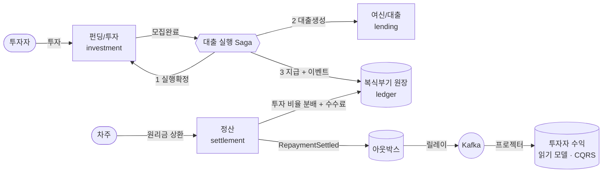

# pfct — 미니 P2P 대출·투자 플랫폼

금융 도메인의 복잡함을 **정확하게** 코드로 풀어내는 것을 목표로 한 백엔드 포트폴리오입니다.
투자 → 대출 실행 → 상환 → 정산으로 이어지는 자금의 일생을, 모든 이동을 **복식부기 원장**에 기록하며
"돈이 한 푼도 생기거나 사라지지 않음"을 타입과 테스트로 보장합니다.

## 자금의 일생 (아키텍처)



- **쓰기측**: 모든 자금 이동은 차변=대변 불변식을 강제하는 원장 거래로만 기록된다.
- **분산 트랜잭션**: 대출 실행은 오케스트레이션 Saga(독립 트랜잭션 단계 + 역순 보상)로 처리된다.
- **이벤트**: 상태 변경과 같은 트랜잭션으로 아웃박스에 적재 → 릴레이가 Kafka로 발행(at-least-once).
- **읽기측**: 정산 이벤트를 구독해 조회 전용 읽기 모델을 갱신(CQRS, 읽기측 멱등).

## 핵심 설계 (왜 이렇게?)

설계 결정은 모두 [ADR](docs/adr/)에 근거와 대안을 남겼습니다.

| 주제 | 결정 | ADR |
|------|------|-----|
| 정합성 | 복식부기 원장(차변=대변 불변식) | [0004](docs/adr/0004-double-entry-ledger-for-money-movement.md) |
| 동시성 | 펀딩 막차 경쟁에 비관적 락(오버펀딩 0) | [0005](docs/adr/0005-pessimistic-locking-for-funding-concurrency.md) |
| 금액 | BigDecimal 기반 Money VO(부동소수점 차단) | [0006](docs/adr/0006-money-value-object-with-bigdecimal.md) |
| 멱등 | 거래 ID = 멱등 키(append-only 원장) | [0007](docs/adr/0007-idempotent-append-only-ledger-writes.md) |
| 분산 트랜잭션 | 오케스트레이션 Saga + 보상 | [0008](docs/adr/0008-orchestrated-saga-for-loan-execution.md) |
| 이중 쓰기 | 트랜잭셔널 아웃박스 | [0009](docs/adr/0009-transactional-outbox-for-event-publishing.md) |
| EDA | Kafka(키=aggregateId, at-least-once) | [0011](docs/adr/0011-kafka-as-event-transport.md) |
| 조회 | 이벤트 기반 CQRS 읽기 모델 | [0012](docs/adr/0012-cqrs-read-model-via-events.md) |

## 기술 스택

Kotlin 1.9.25 · Java 21 · Spring Boot 3.5.15 · Gradle 8.14.5(멀티모듈)
PostgreSQL · Apache Kafka · Flyway · JPA/Hibernate · Testcontainers · ArchUnit

## 모듈 구조

의존성 방향은 항상 `adapter → application → domain`이며, 도메인은 프레임워크에 의존하지 않습니다
(ArchUnit 테스트로 강제). 컨텍스트(모듈) 간 통신은 이벤트로 이뤄집니다.

| 모듈 | 책임 |
|------|------|
| `common` | Money, AnnualInterestRate, DomainEvent 등 금융 원시 타입(프레임워크 0 의존) |
| `modules/ledger` | 복식부기 원장(계정계) |
| `modules/investment` | 펀딩/투자 — 오버펀딩 금지 불변식, 비관적 락, 개별 투자 내역 |
| `modules/lending` | 여신/대출 — 원리금균등 상환 스케줄(이자 계산) |
| `modules/settlement` | 정산 비율 분배기(최대 잉여 방식, 분배 합 보존) |
| `modules/outbox` | 트랜잭셔널 아웃박스 플랫폼(레코더 + 릴레이 + Kafka 발행) |
| `bootstrap` | Spring Boot 조립, REST API, 대출 실행 Saga, 정산, CQRS 프로젝터 |

## 실행 방법

### 1) 인프라 기동 (PostgreSQL + Kafka)

```bash
docker compose up -d
```

> 9092 포트가 이미 사용 중이면 `docker-compose.yml`의 Kafka 포트를 바꾸고
> 앱 실행 시 `KAFKA_BOOTSTRAP` 환경변수로 맞춰주세요.

### 2) 애플리케이션 실행

```bash
./gradlew :bootstrap:bootRun
# DB/Kafka 접속 정보는 환경변수로 재정의 가능:
#   DB_URL, DB_USERNAME, DB_PASSWORD, KAFKA_BOOTSTRAP
```

### 3) 테스트

```bash
./gradlew build            # 전체 빌드 + 모든 테스트
./gradlew :common:test     # 순수 단위 테스트(Docker 불필요)
./gradlew :bootstrap:test  # 통합 테스트(Docker 필요: Testcontainers)
```

통합 테스트는 실제 PostgreSQL/Kafka 컨테이너를 띄워 검증합니다(Docker 데몬 필요).

## 주요 API

| 메서드 | 경로 | 설명 |
|--------|------|------|
| `POST` | `/api/funding-rounds` | 펀딩 라운드 개설 |
| `POST` | `/api/funding-rounds/{id}/investments` | 투자(비관적 락으로 오버펀딩 차단) |
| `POST` | `/api/loans/execute` | 대출 실행(Saga) |
| `POST` | `/api/loans/{loanId}/settlements` | 상환 정산(비율 분배 + 수수료) |
| `GET`  | `/api/investors/{id}/returns` | 투자자 수익 조회(CQRS 읽기 모델) |

## 테스트 전략

- **순수 단위 테스트**: 도메인/계산기(원리금균등 스케줄, 비율 분배기) — 프레임워크·DB 없이 빠르게.
- **통합 테스트(Testcontainers)**: 실제 Postgres/Kafka로 정합성을 *증명*. 대표 사례:
  - 200스레드 동시 투자 → 정확히 100건 성공, 오버펀딩 0
  - 대출 실행 Saga 정상/보상(롤백)/멱등 재실행
  - 아웃박스 → Kafka → CQRS 읽기 모델 갱신
- **아키텍처 테스트(ArchUnit)**: 계층 의존 규칙을 컴파일된 클래스로 강제.

## AI 활용

이 프로젝트는 AI 페어 프로그래밍으로 개발하되, **AI 출력을 항상 검증하고 교정**했습니다(실제 사례):

- **Testcontainers 컨테이너 생명주기 버그**: 처음 `@Container` 방식이 멀티 클래스 테스트에서 컨테이너를
  조기 종료시켜 연결 실패 → 테스트 실패로 포착 후 **싱글턴 컨테이너 패턴**으로 교정.
- **Kafka 헤더 매핑**: byte[] 헤더가 컨슈머에서 String으로 매핑되지 않는 문제를 예견하고
  Spring `Message` 기반 발행으로 사전 교정.
- **테스트 격리 결함**: 전역 `platform:fee` 계정 누적으로 정산 테스트가 깨지는 것을 발견 →
  절대값이 아닌 **증분**을 측정하도록 수정.

## 문서

- [`docs/adr/`](docs/adr/) — 설계 결정 기록(ADR): 무엇을, 왜, 어떤 대안을 제치고
- [`STATUS.md`](STATUS.md) — 현재 진행 상태와 다음 작업
- [`MEMORY.md`](MEMORY.md) — 누적 결정 로그와 핵심 규칙
- [`CLAUDE.md`](CLAUDE.md) — 기여 지침과 결정 기록 프로토콜

## 진행 상태

Phase A(도메인 코어) · B(투자 영속화·동시성·대출 실행 Saga·아웃박스) · C(정산·ArchUnit·Kafka·CQRS) 완료.
상세는 [`STATUS.md`](STATUS.md) 참고.
